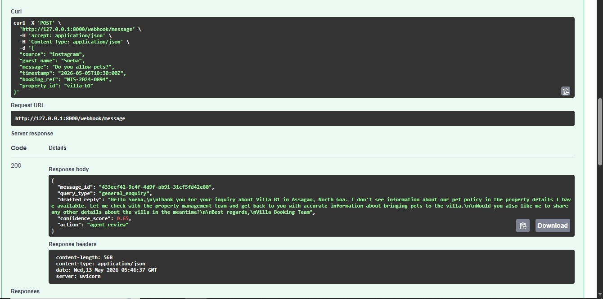
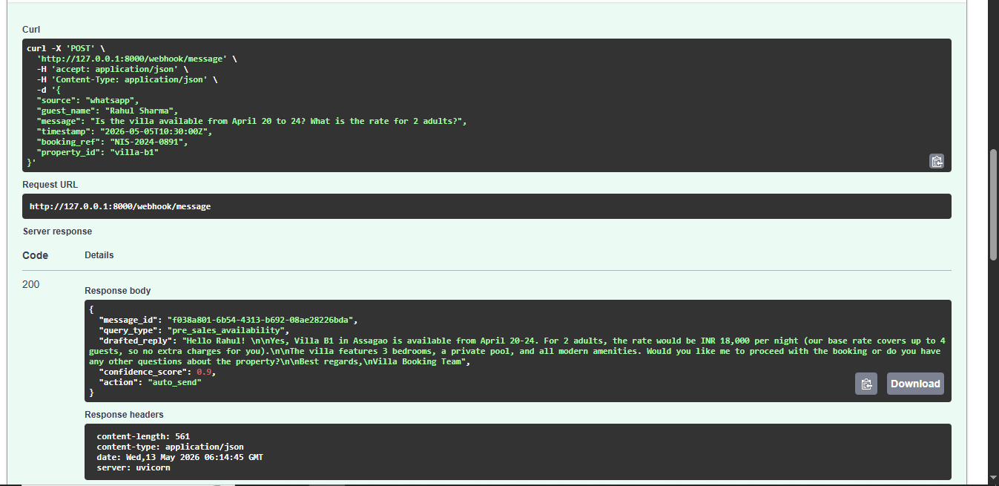

🚀Nistula Technical Assessment->

**📌AI-Powered Guest Messaging Backend System:

Overview:

This project implements a backend system that processes inbound guest messages from multiple channels, normalizes them into a unified format, classifies the intent, generates AI-powered responses using Claude, and returns a structured output with a confidence score and recommended action.

The goal is to simulate a real-world intelligent messaging system used in hospitality platforms like Nistula

-----------------------------------------------------------------------
🛠Tech Stack:

Backend: Python + FastAPI
AI Integration: Claude (Anthropic API)
Environment Management: python-dotenv
HTTP Requests: requests
Testing: Swagger UI (FastAPI Docs)
-----------------------------------------------------------
🧩System Architecture:

Inbound Webhook
      ↓
Normalization Layer
      ↓
Query Classification
      ↓
AI Prompt Construction
      ↓
Claude API
      ↓
Response + Confidence Scoring
      ↓
Action Decision Engine
      ↓
Structured API Response
-----------------------------------------------------------------------
🔗 API Endpoint:
POST /webhook/message

Processes inbound guest messages.

📥 Sample Request:

{
  "source": "instagram",
  "guest_name": "Sneha",
  "message": "Do you allow pets?",
  "timestamp": "2026-05-05T10:30:00Z",
  "booking_ref": "NIS-2024-0894",
  "property_id": "villa-b1"
}

📥 Sample Response:
{
  "message_id": "433ecf42-9c4f-4d9f-ab91-31cf5fd42e80",
  "query_type": "general_enquiry",
  "drafted_reply": "Hello Sneha,\n\nThank you for your inquiry about Villa B1 in Assagao, North Goa. I don't see information about our pet policy in the property details I have available. Let me check with the property management team and get back to you with accurate information about bringing pets to the villa.\n\nWould you also like me to share any other details about the villa in the meantime?\n\nBest regards,\nVilla Booking Team",
  "confidence_score": 0.65,
  "action": "agent_review"
}

📥 As per your example given:
{
  "source": "whatsapp",
  "guest_name": "Rahul Sharma",
  "message": "Is the villa available from April 20 to 24? What is the rate for 2 adults?",
  "timestamp": "2026-05-05T10:30:00Z",
  "booking_ref": "NIS-2024-0891",
  "property_id": "villa-b1"
}

📥 Response:

{
  "message_id": "f038a801-6b54-4313-b692-08ae28226bda",
  "query_type": "pre_sales_availability",
  "drafted_reply": "Hello Rahul! \n\nYes, Villa B1 in Assagao is available from April 20-24. For 2 adults, the rate would be INR 18,000 per night (our base rate covers up to 4 guests, so no extra charges for you).\n\nThe villa features 3 bedrooms, a private pool, and all modern amenities. Would you like me to proceed with the booking or do you have any other questions about the property?\n\nBest regards,\nVilla Booking Team",
  "confidence_score": 0.9,
  "action": "auto_send"
}

----------------------------------------------------------------

⚙️Core Components:

1. Normalization Layer

Transforms incoming messages into a unified schema with a generated UUID.
Example normalization:

Input:
"message" → message_text  
Generated → message_id (UUID)  
All other fields preserved  

2. Query Classification

Classifies messages into:

pre_sales_availability
pre_sales_pricing
post_sales_checkin
special_request
complaint
general_enquiry

Rule-based keyword classification is used for simplicity and speed.

3. AI Response Generation
Uses Claude Sonnet 4 model
Injects structured property context into prompt
Generates concise, polite, and context-aware replies

4. Confidence Scoring Logic
- Complaint → 0.4 (low confidence, requires escalation)
- Short/unclear queries → ~0.65
- Pricing/availability → 0.9 (high confidence)
- General queries → ~0.8

Confidence scoring is based on:
- Query clarity (length + keywords)
- Query type certainty
- Data availability (e.g., pricing known → high confidence)

This ensures deterministic and explainable scoring.

5. Action Decision Engine
Confidence	Action
> 0.85	auto_send
0.60 – 0.85	agent_review
< 0.60 OR complaint	escalate

-------------------------------------------------------------------

### Claude Prompt Design

The system injects structured property context into every AI request:

Property: Villa B1, Assagao, North Goa  
Bedrooms: 3 | Max guests: 6 | Private pool: Yes  
Check-in: 2pm | Check-out: 11am  
Base rate: INR 18,000 per night  
Extra guest: INR 2,000  
WiFi password: Nistula@2024  
Caretaker: 8am–10pm  
Chef on call: Yes  
Availability April 20–24: Available  
Cancellation: Free up to 7 days  

-----------------------------------------------------------
⚠️Error Handling:
API failures (Claude) are handled with fallback responses
Prevents system crashes and ensures graceful degradation
Returns safe default message if AI fails
-----------------------------------------------------------------------

▶️How to Run Locally

1. Clone Repository
git clone https://github.com/your-username/nistula-technical-assessment.git

cd nistula-technical-assessment

2. Create Virtual Environment
python -m venv venv
source venv/bin/activate   # Windows: venv\Scripts\activate

3. Install Dependencies
pip install -r requirements.txt

4. Setup Environment Variables

Create .env file:
CLAUDE_API_KEY=your_api_key_here

5. Run Server
uvicorn app.main:app --reload

6. Open API Docs

👉 http://127.0.0.1:8000/docs
-----------------------------------------------------------

 🧪Testing:

The API was tested with multiple scenarios:

 Availability + Pricing Query

→ High confidence, auto_send

 Complaint Scenario:

→ Low confidence, escalate

 General Enquiry:

→ Medium confidence, agent_review

(Screenshots attached in repository)

-----------------------------------------------------------------------
🗄 Database Design

The schema supports:

Unified guest profiles across channels
Conversations linked to reservations
Centralized message storage
AI metadata tracking (confidence, query type)
Agent intervention tracking
Event logging for automation

Refer: schema.sql
----------------------------------------------------

🧠Design Decisions:

Modular architecture for scalability
Separation of AI responses for auditability
Conversation layer for context tracking
Rule-based classification for deterministic behavior
Fallback handling for reliability